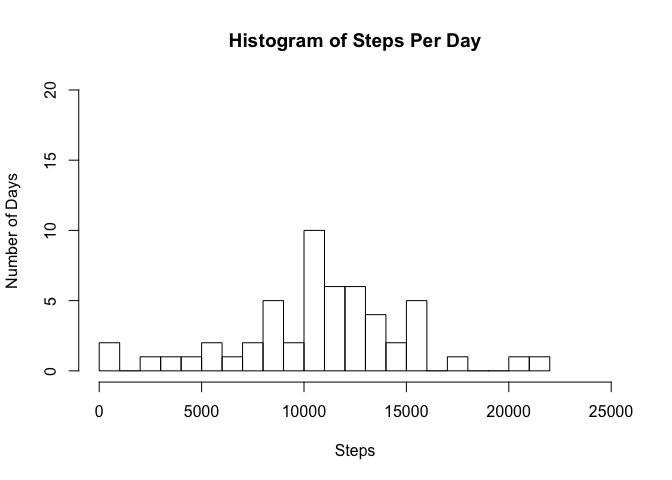
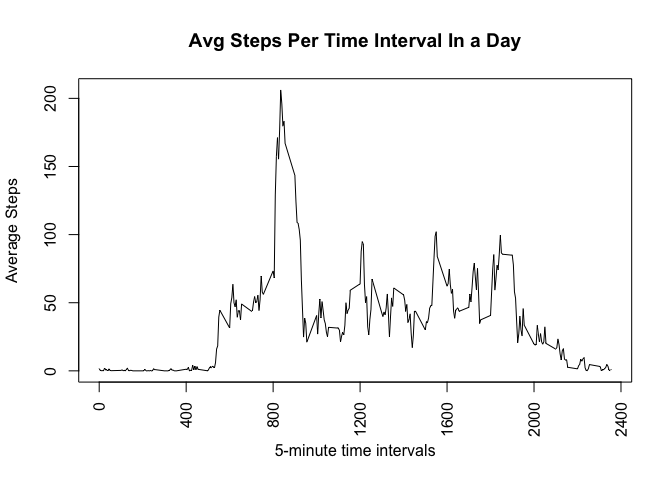
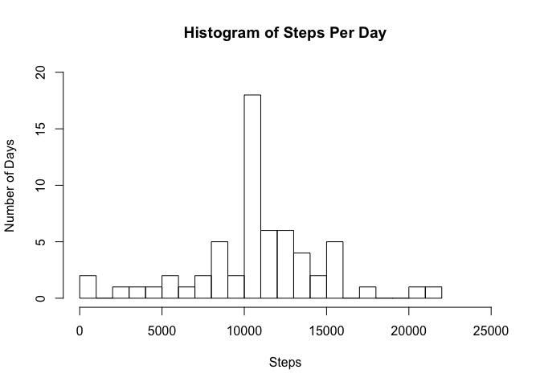
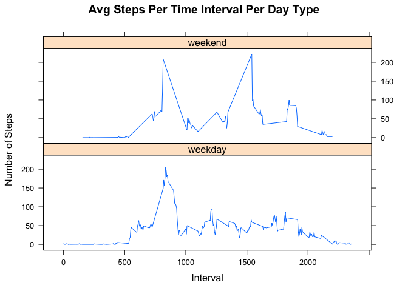

# Reproducible Research: Peer Assessment 1


## Loading and preprocessing the data

1. Download and unzip the dataset if it doesn't exist locally

```r
dataset_zip_name <- "repdata_data_activity.zip"

if(!file.exists(dataset_zip_name)) {
  dataset_url <- "https://d396qusza40orc.cloudfront.net/repdata%2Fdata%2Factivity.zip"
  download.file(url=dataset_url, destfile = dataset_zip_name, method="curl" )
}

activity_file_name <- "activity.csv"
if(!file.exists(activity_file_name)) {
  unzip(dataset_zip_name)
}
```

2. Load the dataset

```r
activity_data <- read.csv(activity_file_name)
```

## What is mean total number of steps taken per day?
1. Calculate the total number of steps taken per day

```r
sum_steps_per_day <- aggregate(steps ~ date, activity_data, sum, na.rm=TRUE)
```

2. Make a histogram of the total number of steps taken each day

```r
hist(sum_steps_per_day$steps, main="Histogram of Steps Per Day", xlab="Steps", ylab="Number of Days", breaks=20, xlim=c(0,25000), ylim=c(0,20))
```

<!-- -->

3. Calculate and report the mean and median of the total number of steps taken per day

```r
options(scipen=999)
mean_steps_per_day <- mean(sum_steps_per_day$steps)
median_steps_per_day <- median(sum_steps_per_day$steps)
```

* The mean steps per day is: 10766.1886792
* The median steps per day is: 10765

## What is the average daily activity pattern?
Calculate the average daily activity pattern

```r
avg_steps_per_interval <- aggregate(steps ~ interval, activity_data, mean, na.rm=TRUE)
```

1. Make a time series plot (i.e. type = "l") of the 5-minute interval (x-axis) and the average number of steps taken, averaged across all days (y-axis)

```r
plot(x=avg_steps_per_interval$interval, y=avg_steps_per_interval$steps, type='l', main="Avg Steps Per Time Interval In a Day", xlab="5-minute time intervals", ylab="Average Steps", xaxt='n')
axis(1, at = seq(0, 2400, by = 400), las=2)
```

<!-- -->

2. Which 5-minute interval, on average across all the days in the dataset, contains the maximum number of steps?
* The 5-interval that contains the maximum average number of steps is: 835

## Imputing missing values

1. Calculate and report the total number of missing values in the dataset (i.e. the total number of rows with NAs)

```r
row_has_na <- apply(activity_data, 1, function(x){any(is.na(x))})
total_na_rows <- sum(row_has_na)
```
* There are 2304 total rows with NAs

2. Devise a strategy for filling in all of the missing values in the dataset. The strategy does not need to be sophisticated. For example, you could use the mean/median for that day, or the mean for that 5-minute interval, etc.
* My strategy is to use the R Bioconductor Impute package to impute the missing data using the impute.knn method
* In order to impute the missing values using the impute.knn method, I will need to do the following:
    + Reshape the dataset from long to wide (dcast)
    + Apply impute.knn
    + Reshape from wide to long (melt)

3. Create a new dataset that is equal to the original dataset but with the missing data filled in.

```r
library(impute)
library(reshape2)

activity_data_wide <- dcast(activity_data, date ~ interval, value.var = "steps")
tmp <- activity_data_wide[,-1]
tmp_imputed <- impute.knn(as.matrix(tmp))
activity_data_wide_imputed <- data.frame(date=activity_data_wide$date, tmp_imputed$data)
colnames(activity_data_wide_imputed) <- colnames(activity_data_wide)
activity_data_imputed <- melt(activity_data_wide_imputed, id.vars=c("date"))
colnames(activity_data_imputed) <- c("date", "interval", "steps")
activity_data_imputed$interval <- as.integer(as.character(activity_data_imputed$interval))
```

4.1. Make a histogram of the total number of steps taken each day and Calculate and report the mean and median total number of steps taken per day. 

```r
imputed_data_sum_steps_per_day <- aggregate(steps ~ date, activity_data_imputed, sum, na.rm=TRUE)

hist(imputed_data_sum_steps_per_day$steps, main="Histogram of Steps Per Day", xlab="Steps", ylab="Number of Days", breaks=20, xlim=c(0,25000), ylim=c(0,20))
```

<!-- -->

```r
options(scipen=999)
imputed_data_mean_steps_per_day <- mean(imputed_data_sum_steps_per_day$steps)
imputed_data_median_steps_per_day <- median(imputed_data_sum_steps_per_day$steps)
```

* The mean steps per day is: 10766.1886792
* The median steps per day is: 10766.1886792

4.2 Do these values differ from the estimates from the first part of the assignment? What is the impact of imputing missing data on the estimates of the total daily number of steps?

* The mean values are the same 
    + Original mean = 10766.1886792; New mean = 10766.1886792
* The median values differ slightly
    + Original median = 10765; New median = 10766.1886792
* By imputing the missing data, we now have 8 more days with step values. Thus, our original histogram only displayed data from 53 days, while the new histogram displays data from 61 days.


## Are there differences in activity patterns between weekdays and weekends?

1. Create a new factor variable in the dataset with two levels – “weekday” and “weekend” indicating whether a given date is a weekday or weekend day.

```r
activity_data_imputed$dateType <- strptime(activity_data$date, "%Y-%m-%d")
activity_data_imputed$weekdays <- weekdays(activity_data_imputed$dateType)
activity_data_imputed$dayType <- as.factor(ifelse(activity_data_imputed$weekdays == "Saturday" | activity_data_imputed$weekdays == "Sunday", "weekend", "weekday"))
```

2. Make a panel plot containing a time series plot (i.e. type = "l") of the 5-minute interval (x-axis) and the average number of steps taken, averaged across all weekday days or weekend days (y-axis). See the README file in the GitHub repository to see an example of what this plot should look like using simulated data.

```r
library(lattice)

avg_steps_per_interval_dayType <- aggregate(steps ~ interval + dayType, activity_data_imputed, mean, na.rm=TRUE)
xyplot(avg_steps_per_interval_dayType$steps ~ avg_steps_per_interval_dayType$interval | avg_steps_per_interval_dayType$dayType, main="Avg Steps Per Time Interval Per Day Type",xlab="Interval", ylab="Number of Steps",layout=c(1,2), type="l")
```

<!-- -->
